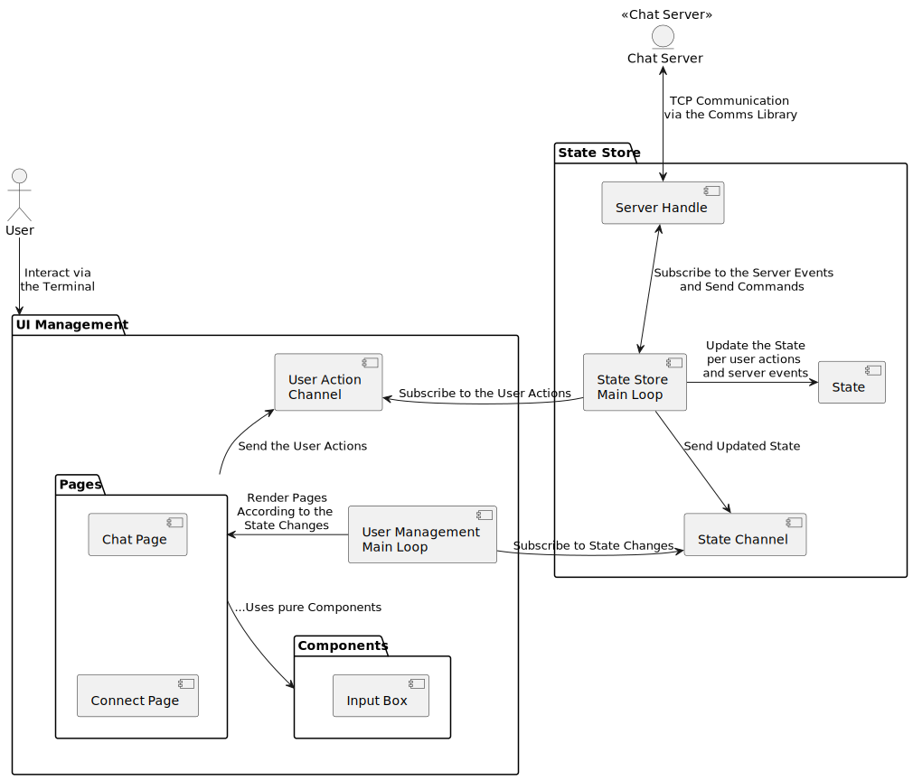

# 🎮 Rust Chat Server - TUI Client

The `tui` binary provides a terminal-based UI for the [rust-chat-server](../). This interface communicates with the server using a TCP client via our [comms library](../comms).

---

## 🛠 Technical Stack

- **Async I/O**: Leverages [Tokio](https://tokio.rs/) for asynchronous tasks and non-blocking I/O, integrating both [Tokio Streams](https://tokio.rs/tokio/tutorial/streams) and [Crossterm's EventStream](https://docs.rs/crossterm/latest/crossterm/event/struct.EventStream.html).
- **Flux-inspired Design**: Implements a simplified [Flux Architecture](https://facebookarchive.github.io/flux/docs/in-depth-overview) to decouple UI and user/server interactions, facilitated by [Tokio Channels](https://tokio.rs/tokio/tutorial/channels).
- **TUI Rendering**: Utilizes [ratatui-org/ratatui](https://github.com/ratatui-org/ratatui) for terminal-based UI rendering.

## 🏗 Architectural Overview

1. **State Store & UI Management Loop**: On startup, the application initializes loops for both **State Store** and **UI Management**, and sets up channels for **State Updates** and **User Actions**.
2. **UI Management**:
   - **Pages** and **Components** sub-modules separate UI-related logic, resembling the structural design in modern web SPAs.
   - State-linked components can emit **User Actions** like server connection requests, room joins, and message sends.
   - A dedicated loop orchestrates the UI updates based on both state changes and terminal events.
3. **State Store**:
   - **State Store** subscribes to **User Actions** to manage server connections and commands.
   - Upon processing **User Actions** or **Server Events**, **State Store** pushes the new state to the **State Channel** for UI updates.

## 🚀 Quick Start

Run the TUI client using `cargo run` or `cargo run --bin tui`. Upon bootstrap, you will be asked to enter a server address. The server address field will default to `127.0.0.1:8080`. Press `<Enter>` after entering the server you want to connect to.

Server disconnections will trigger a state reset, requiring re-login.
